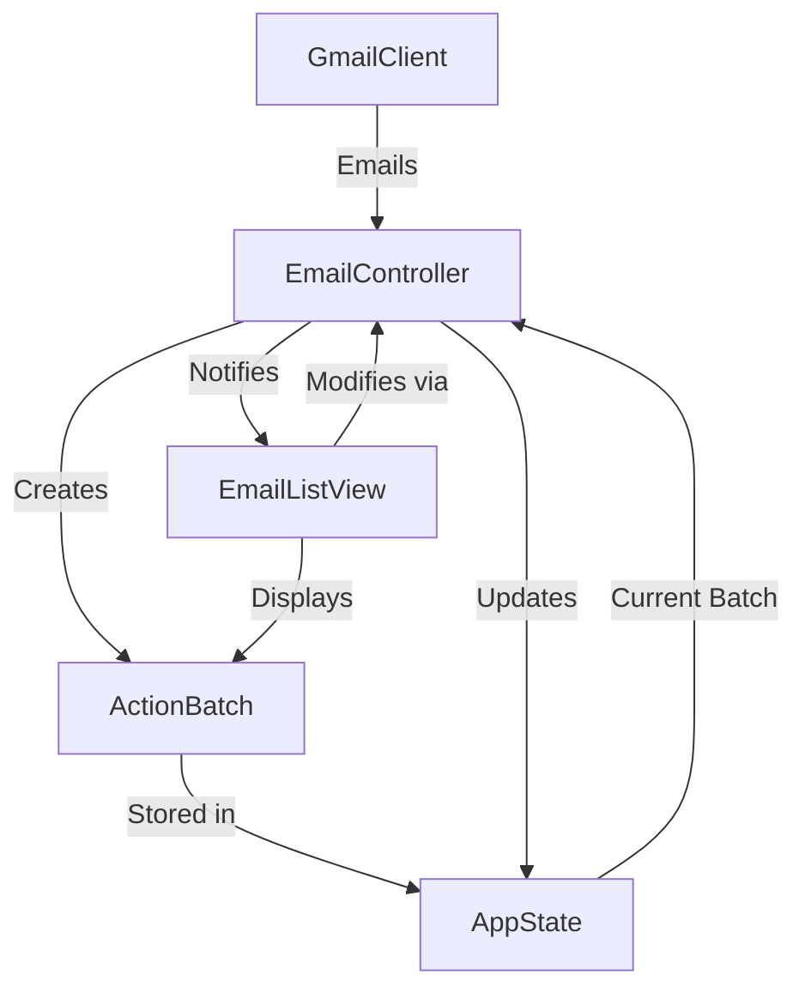

# Inbox Management System Design Document

## 1. Problem Statement
The current email management workflow is inefficient and requires manual sorting. We need to create a Terminal User Interface (TUI) that allows users to efficiently review and execute AI-suggested email classifications while maintaining complete keyboard control.

## 2. Goals and Non-Goals

### 2.1 Goals
- Create an efficient TUI for reviewing and modifying AI-suggested email actions
- Support complete keyboard navigation and control
- Organize emails by destination using tabs
- Provide list-based action management with detailed card view to quickly edit actions
- Enable batch processing of emails with similar suggested destinations
- Implement undo/redo functionality for action modifications

### 2.2 Non-Goals
- Modifying the underlying email classification system
- Supporting mouse interactions
- Implementing custom keyboard shortcut configuration (future enhancement)
- Modifying Gmail API integration

## 3. Technical Design

### 3.1 Architecture Overview
The system will be built using the Textual framework and will follow a Model-View-Controller (MVC) pattern:

```
├── models/
│   ├── action.py          # Email action data structures
│   ├── batch.py          # Batch operations data structures
│   ├── state.py          # Centralized state management with observer pattern
│   └── gmail.py          # Gmail client wrapper
├── views/
│   ├── tab_view.py       # Tab container for organizing email destinations
│   ├── list_view.py      # DataTable-based email list with action controls
│   ├── card_view.py      # Quick action editing modal
│   └── components/       # Reusable UI components
├── controllers/
│   └── email_controller.py  # Unified controller for all email action operations
└── app.py                # Main application entry point
```

Key Design Principles:
1. Efficient Workflow: Quick keyboard-driven action editing
2. Single Source of Truth: Centralized state management through batch operations
3. Direct Updates: Minimal message passing between components
4. Clear Responsibilities: Separate views for different interaction models

### 3.2 Key Components

#### 3.2.1 State Management and Controller Updates
```python
# State Management
class AppState:
    """Global application state."""
    def __init__(self):
        self.current_batch: Optional[ActionBatch] = None
        self.history: deque[ActionHistoryEntry] = deque(maxlen=10)
        self.redo_stack: deque[ActionHistoryEntry] = deque()
        self.batches: dict[str, ActionBatch] = {}
    
    def set_current_batch(self, batch: ActionBatch) -> None:
        """Set the current batch being processed."""
        self.current_batch = batch
        self.batches[batch.id] = batch
        # Clear redo stack when starting new batch
        self.redo_stack.clear()

    def record_action_change(self, before: InboxAction, after: InboxAction, batch_id: str) -> None:
        """Record a change in action state for undo/redo."""
        entry = ActionHistoryEntry(
            action_before=before,
            action_after=after,
            batch_id=batch_id
        )
        self.history.append(entry)
        self.redo_stack.clear()

# Controller Update Management
class EmailController:
    """Unified controller for email operations."""
    def __init__(self, gmail: GmailWrapper, state: AppState):
        self.gmail = gmail
        self.state = state
        self._batch_updated_callbacks: list[Callable[[ActionBatch], None]] = []

    def add_batch_updated_callback(self, callback: Callable[[ActionBatch], None]) -> None:
        """Add a callback for batch updates."""
        if callback not in self._batch_updated_callbacks:
            self._batch_updated_callbacks.append(callback)

    def _notify_batch_updated(self) -> None:
        """Notify listeners of batch updates."""
        if self.state.current_batch:
            for callback in self._batch_updated_callbacks:
                callback(self.state.current_batch)

    def modify_action(self, action: InboxAction, **modifications) -> None:
        """Modify an action and notify listeners."""
        if not action.can_modify:
            return

        # Record history
        action_before = deepcopy(action)
        
        # Apply modifications
        for attr, value in modifications.items():
            if hasattr(action, f"set_{attr}"):
                getattr(action, f"set_{attr}")(value)

        # Record change and notify
        self.state.record_action_change(
            action_before,
            deepcopy(action),
            self.state.current_batch.id
        )
        self._notify_batch_updated()
```

#### 3.2.2 View Components

##### 3.2.2.1 Email Tabs
```python
class EmailTabs(Widget):
    """Tab container for different email destinations."""
    def __init__(self, actions: list[InboxAction], controller: EmailController):
        self._destination_batches = batch_by_destination(actions)
        self._controller = controller

    def compose(self):
        """Create tab per destination with email list view."""
        with TabbedContent():
            for dest in EmailDestination:
                dest_batch = self._destination_batches.get(dest)
                with TabPane(f"[b]{dest.name}[/b]"):
                    yield EmailListView(
                        email_batch=dest_batch,
                        controller=self._controller
                    )

    def action_execute_batch(self) -> None:
        """Execute the current batch of actions."""
        current_tab = self.query_one("TabbedContent TabPane.-active")
        if not current_tab:
            return
            
        list_view = current_tab.query_one("EmailListView")
        if not list_view or not list_view.current_batch:
            return

        self.post_message(self.ExecuteBatch())
```

##### 3.2.2.2 Email List
```python
class EmailListView(Widget):
    """Widget for displaying and managing email actions."""
    BINDINGS = [
        ("space", "toggle_accept", "Accept/Reject"),
        ("enter", "view_details", "View Details"),
        ("e", "edit_destination", "Edit Destination"),
        ("r", "toggle_read", "Toggle Read"),
        ("j", "cursor_down", "Down"),
        ("k", "cursor_up", "Up"),
    ]

    # Reactive property for batch updates
    current_batch = reactive[ActionBatch | None](None)

    def __init__(self, email_batch: Optional[ActionBatch], controller: EmailController):
        super().__init__()
        self._controller = controller
        self._table = DataTable()
        self._table.cursor_type = "row"
        self.current_batch = email_batch
        
        # Register for batch updates
        if controller:
            controller.add_batch_updated_callback(self._on_batch_updated)

    def _on_batch_updated(self, batch: ActionBatch) -> None:
        """Handle batch updates from the controller."""
        self.current_batch = batch

    def compose(self):
        """Create child widgets."""
        yield self._table

    def on_mount(self) -> None:
        """Set up the table when the widget is mounted."""
        self._table.add_columns(
            "Status",
            "Subject",
            "From",
            "Time",
            "Read"
        )
        self._refresh_table()

    def _refresh_table(self) -> None:
        """Refresh the table contents."""
        self._table.clear()
        if not self.current_batch:
            return
            
        for action in self.current_batch.actions:
            status_indicators = {
                ActionStatus.PENDING: "•",    # Bullet
                ActionStatus.ACCEPTED: "✓",   # Check mark
                ActionStatus.REJECTED: "✗",   # Cross mark
                ActionStatus.EXECUTING: "⋯",  # Ellipsis
                ActionStatus.EXECUTED: "✓",   # Check mark
                ActionStatus.FAILED: "⚠",     # Warning
            }
            
            self._table.add_row(
                f"{status_indicators[action.status]} {action.status.name}",
                action.email.subject,
                action.email.sender,
                action.email.timestamp.strftime("%Y-%m-%d %H:%M"),
                "Yes" if action.mark_as_read else "No",
            )

    def _get_selected_action(self) -> InboxAction | None:
        """Get the currently selected action."""
        if not self.current_batch or self._table.cursor_row is None:
            return None
        return self.current_batch.actions[self._table.cursor_row]

    def action_toggle_accept(self) -> None:
        """Toggle between accepting and rejecting the selected action."""
        action = self._get_selected_action()
        if not action or not action.can_modify:
            return

        new_status = ActionStatus.ACCEPTED if action.status != ActionStatus.ACCEPTED else ActionStatus.REJECTED
        self._controller.modify_action(action, status=new_status)

    def action_toggle_read(self) -> None:
        """Toggle read status of the selected action."""
        action = self._get_selected_action()
        if not action or not action.can_modify:
            return
            
        self._controller.modify_action(action, mark_as_read=not action.mark_as_read)
```

#### 3.2.3 Email Card View
```python
class EmailCardView(ModalScreen):
    """Quick action editing modal."""
    BINDINGS = [
        ("escape", "dismiss", "Close"),
        ("space", "toggle_accept", "Accept/Reject"),
        ("e", "edit_destination", "Edit"),
        ("r", "toggle_read", "Toggle Read"),
        ("j", "next_email", "Next Email"),
        ("k", "prev_email", "Previous Email")
    ]

    def __init__(self, email_id: str, controller: EmailController):
        self.controller = controller
        self.email_id = email_id

    def compose(self):
        """Create quick editing interface."""
        # Email details with keyboard shortcuts
        # Destination selection
        # Read status toggle
        # Action status indicators
```

#### 3.2.4 Email Controller
```python
class EmailController:
    """Unified email operations controller."""
    def __init__(self, gmail: GmailWrapper, state: AppState):
        self.gmail = gmail
        self.state = state

    async def process_action(self, email_id: str, operation: str):
        """Handle all email operations."""
        try:
            # Get current action
            action = self.state.get_action(email_id)
            
            # Perform operation
            if operation == "accept":
                updated = await self._accept_action(action)
            elif operation == "toggle_read":
                updated = await self._toggle_read(action)
            # etc...
            
            # Update state and notify
            self.state.update_action(updated)
            self.state.notify_observers()
            
        except Exception as e:
            self._handle_error(e)
```

### 3.3 Data Flow



### 3.4 Key Algorithms

#### 3.4.1 Quick Action Processing
```python
async def process_quick_action(self, email_id: str, action_type: str):
    """Process quick keyboard-driven actions."""
    with self.state.transaction() as state:
        # Get current action
        action = state.get_action(email_id)
        if not action:
            return
            
        # Create history entry
        state.push_history(action)
        
        # Apply quick action
        updated = await self._apply_action(action, action_type)
        
        # Update state
        state.update_action(updated)
        
        # Move to next email if configured
        if self.settings.auto_advance:
            self._select_next_email()
```

## 4. User Experience

### 4.1 Keyboard Navigation
Primary shortcuts:
```
Tab View:
Tab           - Switch between destination tabs
x             - Execute current batch

List View:
↑/↓           - Move cursor up/down
Space         - Accept/reject action
e             - Edit destination
r             - Toggle read status
Enter         - Open card view

Card View:
Space         - Accept/reject action
e             - Edit destination
r             - Toggle read status
Esc           - Close card view
```

### 4.2 Visual Design
- Color coding based on action status and destination
- Clear status indicators
- Quick action feedback
- Keyboard shortcut hints
- Error message display

### 4.3 Error Handling
- Centralized error handling
- Clear error messages
- Automatic retry for transient failures
- State rollback on error
- Detailed logging

## 5. Testing Plan

### 5.1 Unit Tests
- State management logic
- Controller operations
- View rendering
- Error handling

### 5.2 Integration Tests
- End-to-end workflows
- State synchronization
- Error recovery


## 6. Rollout Plan

### 6.1 Phase 1 - Core Functionality
- State management
- Basic tab and list views
- Essential keyboard controls
- Error handling

### 6.2 Phase 2 - Features
- Tab-based destination organization
- List view action controls
- Quick action card view
- Batch execution support

### 6.3 Phase 3 - Polish
- Performance optimization
- Error recovery
- UI refinements
- Documentation

## 7. Future Enhancements
- Custom keyboard shortcuts
- Usage analytics
