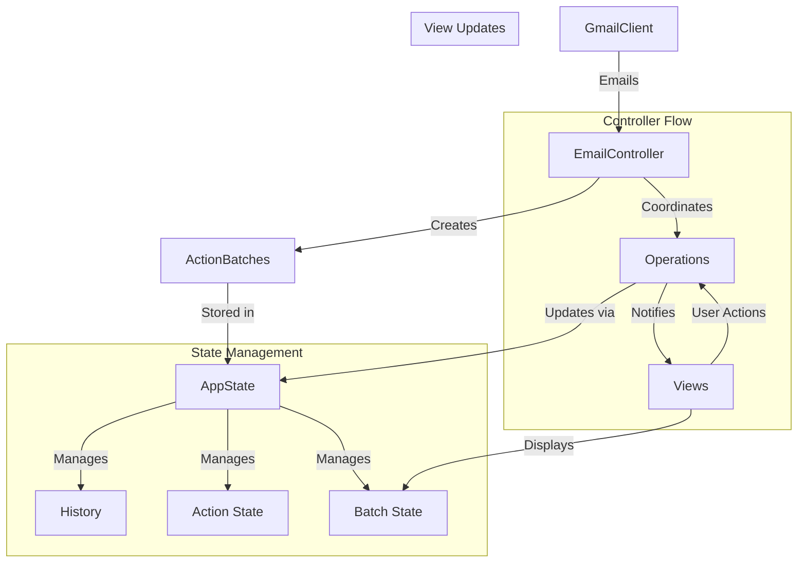

# Inbox Management System Design Document

## 1. Problem Statement
The current email management workflow is inefficient and requires manual sorting. We need to create a Terminal User Interface (TUI) that allows users to efficiently review and execute AI-suggested email classifications while maintaining complete keyboard control.

## 2. Goals and Non-Goals

### 2.1 Goals
- Create an efficient TUI for reviewing and modifying AI-suggested email actions
- Support complete keyboard navigation and control
- Organize emails by destination using tabs
- Provide list-based action management with detailed card view to quickly edit actions
- Enable batch processing of emails with similar suggested destinations
- Implement undo/redo functionality for action modifications

### 2.2 Non-Goals
- Modifying the underlying email classification system
- Supporting mouse interactions
- Implementing custom keyboard shortcut configuration (future enhancement)
- Modifying Gmail API integration

## 3. Technical Design

### 3.1 Architecture Overview
The system will be built using the Textual framework and will follow a Model-View-Controller (MVC) pattern:

```
├── models/
│   ├── action.py          # Email action data structures
│   ├── batch.py          # Batch operations data structures
│   ├── state.py          # Centralized state management with observer pattern
│   └── gmail.py          # Gmail client wrapper
├── views/
│   ├── tab_view.py       # Tab container for organizing email destinations
│   ├── list_view.py      # DataTable-based email list with action controls
│   ├── card_view.py      # Quick action editing modal
│   └── components/       # Reusable UI components
├── controllers/
│   └── email_controller.py  # Unified controller for all email action operations
└── app.py                # Main application entry point
```

Key Design Principles:
1. Single Responsibility: Each component has a clear, focused purpose
   - State manages data, history, and action restoration
   - Controller coordinates high-level operations
   - Models encapsulate business logic
   - Views handle user interaction and display
2. Efficient Workflow: Quick keyboard-driven action editing
3. Single Source of Truth: State manages all data mutations and history
4. Direct Updates: Minimal message passing between components
5. Error Handling: Consistent error reporting and recovery at each layer

### 3.1.1 Destination Management
The system maintains actions in batches organized by destination. When an action's destination changes:
1. The action is automatically removed from its current batch
2. The action is added to the batch corresponding to its new destination
3. The action appears in the appropriate destination tab
4. The state is updated through the controller to maintain consistency
5. All views are notified of the change through the observer pattern

This ensures that:
- Actions are always displayed in the correct destination tab
- State remains consistent between the model and views
- Changes are properly tracked for undo/redo functionality
- The user sees immediate visual feedback when changing destinations

### 3.2 Key Components

#### 3.2.1 State Management and Controller Updates
```python
# State Management
class AppState:
    """Global application state."""
    def __init__(self):
        self.current_batch: Optional[ActionBatch] = None
        self.history: deque[ActionHistoryEntry] = deque(maxlen=10)
        self.redo_stack: deque[ActionHistoryEntry] = deque()
        self.batches: dict[str, ActionBatch] = {}
    
    def set_current_batch(self, batch: ActionBatch) -> None:
        """Set the current batch being processed."""
        self.current_batch = batch
        self.batches[batch.id] = batch
        self.redo_stack.clear()

    def record_action_change(self, before: InboxAction, after: InboxAction, batch_id: str) -> None:
        """Record a change in action state for undo/redo."""
        entry = ActionHistoryEntry(
            action_before=before,
            action_after=after,
            batch_id=batch_id
        )
        self.history.append(entry)
        self.redo_stack.clear()

    def _find_action(self, batch_id: str, email_id: str) -> Optional[InboxAction]:
        """Find an action by its batch and email IDs."""
        batch = self.batches.get(batch_id)
        if not batch:
            return None
            
        for action in batch.actions:
            if action.email.id == email_id:
                return action
        return None

    def _restore_action_state(self, action: InboxAction, source: InboxAction) -> None:
        """Restore an action's state from a source action."""
        action.destination = source.destination
        action.mark_as_read = source.mark_as_read
        action.status = source.status

    def undo(self) -> bool:
        """Undo the last action change."""
        if not self.can_undo():
            return False
        
        entry = self.history.pop()
        self.redo_stack.append(entry)
        
        action = self._find_action(entry.batch_id, entry.action_before.email.id)
        if not action:
            return False
            
        self._restore_action_state(action, entry.action_before)
        return True

    def redo(self) -> bool:
        """Redo the last undone action change."""
        if not self.can_redo():
            return False
        
        entry = self.redo_stack.pop()
        self.history.append(entry)
        
        action = self._find_action(entry.batch_id, entry.action_after.email.id)
        if not action:
            return False
            
        self._restore_action_state(action, entry.action_after)
        return True

# Controller Update Management
class EmailController:
    """Unified controller for email operations."""
    def __init__(self, gmail: GmailWrapper, state: AppState):
        self.gmail = gmail
        self.state = state
        self._batch_callbacks: list[BatchUpdateCallback] = []

    def add_batch_updated_callback(self, callback: BatchUpdateCallback) -> None:
        """Register a callback for batch updates."""
        if callback not in self._batch_callbacks:
            self._batch_callbacks.append(callback)
            logger.debug(f"Registered batch update callback (total: {len(self._batch_callbacks)})")

    def _notify_batch_updated(self) -> None:
        """Notify registered callbacks of batch updates."""
        if not self.state.current_batch:
            return
            
        batch = self.state.current_batch
        for callback in self._batch_callbacks:
            try:
                callback(batch)
            except Exception as e:
                logger.error(f"Error in batch update callback: {e}", exc_info=True)

    def modify_action(self, action: InboxAction, 
                     destination: Optional[EmailDestination] = None,
                     mark_as_read: Optional[bool] = None,
                     status: Optional[ActionStatus] = None) -> None:
        """Modify an action's properties."""
        if not action.can_modify or not self.state.current_batch:
            logger.warning("Cannot modify action in current state")
            return

        # Record state for history
        action_before = deepcopy(action)
        
        # Apply changes
        if destination is not None and destination != action.destination:
            self._change_action_destination(action, destination)
        if mark_as_read is not None:
            action.set_read_status(mark_as_read)
        if status is not None:
            status_updates = {
                ActionStatus.ACCEPTED: action.accept,
                ActionStatus.REJECTED: action.reject,
            }
            if update_func := status_updates.get(status):
                update_func()

        # Record in history
        self.state.record_action_change(
            action_before,
            deepcopy(action),
            self.state.current_batch.id
        )
```

#### 3.2.2 View Components

##### 3.2.2.1 Email Tabs
```python
class EmailTabs(Widget):
    """Tab container for different email destinations."""
    def __init__(self, actions: list[InboxAction], controller: EmailController):
        self._destination_batches = group_by_destination(actions)
        self._controller = controller
        
        # Initialize state batches
        for dest, batch in self._destination_batches.items():
            self._controller.state.batches[dest.name.lower()] = batch

    def compose(self):
        """Create tab per destination with email list view."""
        with TabbedContent():
            for dest in EmailDestination:
                dest_batch = self._destination_batches.get(dest)
                tab = TabPane(f"[b]{dest.name}[/b]")
                tab.destination = dest # Associate tab with destination
                with tab:
                    yield EmailListView(
                        email_batch=dest_batch,
                        controller=self._controller
                    )

    def update_actions(self, actions: list[InboxAction]) -> None:
        """Update tabs with new actions."""
        # For each action, use controller to set its destination
        for action in actions:
            # Get current batch for action
            current_batch = next(
                (batch for batch in self._destination_batches.values() 
                 if action in batch.actions),
                None
            )
            
            # If action's destination doesn't match its current batch, update it
            if current_batch and action.destination != current_batch.actions[0].destination:
                self._controller.modify_action(action, destination=action.destination)
        
        # Update view with new batches
        self._destination_batches = group_by_destination(actions)
        for dest, batch in self._destination_batches.items():
            self._controller.state.batches[dest.name.lower()] = batch
```

##### 3.2.2.2 Email List
```python
class EmailListView(Widget):
    """Widget for displaying and managing email actions."""
    BINDINGS = [
        ("space", "toggle_accept", "Accept/Reject"),
        ("enter", "view_details", "View Details"),
        ("e", "edit_destination", "Edit Destination"),
        ("r", "toggle_read", "Toggle Read"),
        ("j", "cursor_down", "Down"),
        ("k", "cursor_up", "Up"),
    ]

    # Reactive property for batch updates
    current_batch = reactive[ActionBatch | None](None)

    def __init__(self, email_batch: Optional[ActionBatch], controller: EmailController):
        super().__init__()
        self._controller = controller
        self._table = DataTable()
        self._table.cursor_type = "row"
        self.current_batch = email_batch
        
        # Register for batch updates
        if controller:
            controller.add_batch_updated_callback(self._on_batch_updated)

    def _on_batch_updated(self, batch: ActionBatch) -> None:
        """Handle batch updates from the controller."""
        self.current_batch = batch

    def compose(self):
        """Create child widgets."""
        yield self._table

    def on_mount(self) -> None:
        """Set up the table when the widget is mounted."""
        self._table.add_columns(
            "Status",
            "Subject",
            "From",
            "Time",
            "Read"
        )
        self._refresh_table()

    def _refresh_table(self) -> None:
        """Refresh the table contents."""
        self._table.clear()
        if not self.current_batch:
            return
            
        for action in self.current_batch.actions:
            status_indicators = {
                ActionStatus.PENDING: "•",    # Bullet
                ActionStatus.ACCEPTED: "✓",   # Check mark
                ActionStatus.REJECTED: "✗",   # Cross mark
                ActionStatus.EXECUTING: "⋯",  # Ellipsis
                ActionStatus.EXECUTED: "✓",   # Check mark
                ActionStatus.FAILED: "⚠",     # Warning
            }
            
            self._table.add_row(
                f"{status_indicators[action.status]} {action.status.name}",
                action.email.subject,
                action.email.sender,
                action.email.timestamp.strftime("%Y-%m-%d %H:%M"),
                "Yes" if action.mark_as_read else "No",
            )

    def _get_selected_action(self) -> InboxAction | None:
        """Get the currently selected action."""
        if not self.current_batch or self._table.cursor_row is None:
            return None
        return self.current_batch.actions[self._table.cursor_row]

    def action_toggle_accept(self) -> None:
        """Toggle between accepting and rejecting the selected action."""
        action = self._get_selected_action()
        if not action or not action.can_modify:
            return

        new_status = ActionStatus.ACCEPTED if action.status != ActionStatus.ACCEPTED else ActionStatus.REJECTED
        self._controller.modify_action(action, status=new_status)

    def action_toggle_read(self) -> None:
        """Toggle read status of the selected action."""
        action = self._get_selected_action()
        if not action or not action.can_modify:
            return
            
        self._controller.modify_action(action, mark_as_read=not action.mark_as_read)
```

#### 3.2.3 Email Card View
```python
class EmailCardView(ModalScreen):
    """Quick action editing modal."""
    BINDINGS = [
        ("escape", "dismiss", "Close"),
        ("space", "toggle_accept", "Accept/Reject"),
        ("e", "edit_destination", "Edit"),
        ("r", "toggle_read", "Toggle Read"),
        ("j", "next_email", "Next Email"),
        ("k", "prev_email", "Previous Email")
    ]

    def __init__(self, email_id: str, controller: EmailController):
        self.controller = controller
        self.email_id = email_id

    def compose(self):
        """Create quick editing interface."""
        # Email details with keyboard shortcuts
        # Destination selection
        # Read status toggle
        # Action status indicators
```

#### 3.2.4 Email Controller
```python
class EmailController:
    """Unified email operations controller."""
    def __init__(self, gmail: GmailWrapper, state: AppState):
        self.gmail = gmail
        self.state = state

    async def process_action(self, email_id: str, operation: str):
        """Handle all email operations."""
        try:
            # Get current action
            action = self.state.get_action(email_id)
            
            # Perform operation
            if operation == "accept":
                updated = await self._accept_action(action)
            elif operation == "toggle_read":
                updated = await self._toggle_read(action)
            # etc...
            
            # Update state and notify
            self.state.update_action(updated)
            self.state.notify_observers()
            
        except Exception as e:
            self._handle_error(e)
```

### 3.3 Data Flow



### 3.4 Key Algorithms

#### 3.4.1 Quick Action Processing
```python
async def process_quick_action(self, email_id: str, action_type: str):
    """Process quick keyboard-driven actions."""
    with self.state.transaction() as state:
        # Get current action
        action = state.get_action(email_id)
        if not action:
            return
            
        # Create history entry
        state.push_history(action)
        
        # Apply quick action
        updated = await self._apply_action(action, action_type)
        
        # Update state
        state.update_action(updated)
        
        # Move to next email if configured
        if self.settings.auto_advance:
            self._select_next_email()
```

## 4. User Experience

### 4.1 Keyboard Navigation
Primary shortcuts:
```
Tab View:
Tab           - Switch between destination tabs
x             - Execute current batch

List View:
↑/↓           - Move cursor up/down
Space         - Accept/reject action
e             - Edit destination
r             - Toggle read status
Enter         - Open card view

Card View:
Space         - Accept/reject action
e             - Edit destination
r             - Toggle read status
Esc           - Close card view
```

### 4.2 Visual Design
- Color coding based on action status and destination
- Clear status indicators
- Quick action feedback
- Keyboard shortcut hints
- Error message display

### 4.3 Error Handling
Each layer handles errors according to its responsibility:

#### State Layer
- Validates state transitions
- Ensures data consistency during undo/redo
- Maintains history integrity
- Provides rollback capabilities

#### Controller Layer
- Coordinates error recovery
- Logs errors with context
- Updates error messages for UI
- Manages callback error isolation

#### View Layer
- Displays error messages
- Provides user feedback
- Maintains UI consistency
- Handles input validation

Common Features:
- Detailed logging at each layer
- Clear error messages for users
- Graceful degradation
- State consistency preservation

## 5. Testing Plan

### 5.1 Unit Tests

#### State Layer Tests
- History management (undo/redo operations)
- Action state transitions
- Batch state management
- Data consistency validation
- Error recovery mechanisms

#### Controller Layer Tests
- Operation coordination
- Callback management
- Error propagation
- State update notifications
- Gmail API interaction

#### View Layer Tests
- UI component rendering
- User input handling
- Error message display
- State change reactions
- Keyboard navigation

### 5.2 Integration Tests

#### Component Integration
- State-Controller interaction
- Controller-View communication
- View-State synchronization
- Error handling across layers

#### Workflow Testing
- Email processing pipelines
- Batch operations
- User interaction flows
- Error recovery scenarios

#### System Tests
- End-to-end workflows
- Error handling chains
- State consistency


## 6. Rollout Plan

### 6.1 Phase 1 - Core Functionality
- State management
- Basic tab and list views
- Essential keyboard controls
- Error handling

### 6.2 Phase 2 - Features
- Tab-based destination organization
- List view action controls
- Quick action card view
- Batch execution support

### 6.3 Phase 3 - Polish
- Performance optimization
- Error recovery
- UI refinements
- Documentation

## 7. Future Enhancements
- Custom keyboard shortcuts
- Usage analytics
