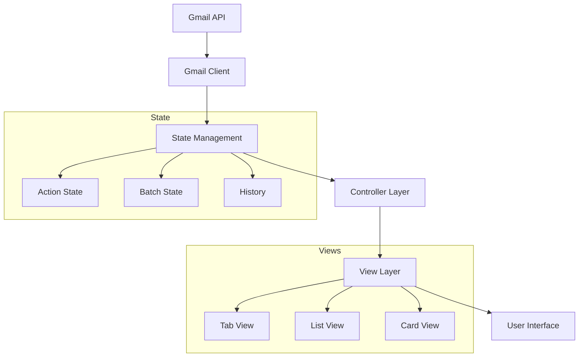

# Inbox Management System Design Document

## 1. Problem Statement
Email management requires constant manual sorting and organization, leading to inefficient workflows and decision fatigue. We need a system that leverages AI suggestions while maintaining user control, enabling efficient email processing through a keyboard-driven interface.

## 2. Goals and Non-Goals

### 2.1 Goals
- Create an efficient Terminal User Interface (TUI) for reviewing AI-suggested email actions
- Enable rapid decision-making through keyboard-driven workflows
- Support batch processing of similar email actions
- Maintain complete user control over email organization
- Provide clear feedback and error recovery mechanisms

### 2.2 Non-Goals
- Modifying the underlying email classification system
- Supporting mouse interactions
- Implementing custom keyboard shortcut configuration
- Modifying Gmail API integration

## 3. Architecture Overview

### 3.1 Core Architecture Principles

1. **State Management**
   - Centralized state with observer pattern for updates
   - Immutable state transitions for predictable behavior
   - History tracking for undo/redo operations
   - Batch-oriented state organization

2. **Action Processing**
   - Clear action lifecycle (Pending → Accepted/Rejected → Executing → Executed/Failed)
   - Atomic operations for consistent state
   - Robust error handling and recovery
   - Batch-level and individual action operations

3. **User Interface**
   - Keyboard-first interaction model
   - Clear visual feedback for all operations
   - Efficient navigation between views
   - Consistent error messaging

4. **Data Flow**
   - Unidirectional data flow for predictable updates
   - Event-driven architecture for UI updates
   - Clear separation of concerns between layers
   - Controlled state mutations

### 3.2 System Components

### 3.3 Key Design Decisions

1. **Batch-Oriented Processing**
   - Actions are grouped into batches for efficient processing
   - Batches maintain their own state and lifecycle
   - Benefits:
     * Efficient bulk operations
     * Simplified state management
     * Clear progress tracking
   - Tradeoffs:
     * Additional complexity in state management
     * Need for batch-level error handling

2. **Observer Pattern for Updates**
   - Components register for state updates
   - Centralized notification system
   - Benefits:
     * Decoupled components
     * Consistent update mechanism
     * Simplified debugging
   - Tradeoffs:
     * Potential for update cycles
     * Memory management considerations

3. **Action State Machine**
   - Clear state transitions
   - Immutable state changes
   - Benefits:
     * Predictable behavior
     * Simple undo/redo
     * Clear error states
   - Tradeoffs:
     * More complex state logic

4. **Error Handling Strategy**
   - Layer-specific error handling
   - Clear error propagation
   - Benefits:
     * Appropriate error context
     * Graceful degradation
     * User-friendly recovery
   - Tradeoffs:
     * Additional error tracking
     * Complex recovery paths

## 4. Implementation Overview

### 4.1 Core Files and Responsibilities

#### Main Application (main.py)
- Application entry point and lifecycle management
- Initializes core components (state, controller, views)
- Handles async operations and loading states
- Manages error messaging and status updates
- Coordinates batch execution workflow

#### State Management (models/state.py)
- Centralized state container using dataclasses
- Maintains action history with undo/redo capability
- Tracks batch organization and current batch
- Provides action lookup and state restoration
- Manages state transitions and consistency

#### Email Controller (controllers/email_controller.py)
- Coordinates all email-related operations
- Manages batch creation and execution
- Handles action modifications and state updates
- Implements observer pattern for view updates
- Provides error handling and recovery
- Coordinates Gmail API interactions

#### List View (views/list_view.py)
- Displays email actions in a table format
- Handles keyboard shortcuts and navigation
- Manages action status visualization
- Provides quick action editing capabilities
- Implements edit mode for destination changes
- Coordinates with card view for detailed editing

#### Tab View (views/tab_view.py)
- Organizes emails by destination using tabs
- Manages tab switching and batch selection
- Coordinates batch execution requests
- Updates view state based on action changes
- Maintains destination-based organization

### 4.2 Component Interactions

1. **Data Flow**
   - Main app loads emails through Gmail client
   - Controller creates batches from email threads
   - State maintains batch and action organization
   - Views observe state changes via callbacks
   - User actions flow through controller to state

2. **View Coordination**
   - Tab view manages high-level organization
   - List view handles action-level interactions
   - Card view provides detailed editing
   - All views update through controller callbacks
   - State changes trigger view refreshes

3. **Action Processing**
   - User initiates action through view
   - View delegates to controller
   - Controller updates state and notifies observers
   - Views refresh to reflect changes
   - History records changes for undo/redo

4. **Error Handling**
   - Each layer handles appropriate errors
   - Controller centralizes error messaging
   - Views display error states
   - State maintains consistency
   - Recovery flows through controller

### 4.3 Key Design Patterns

1. **Observer Pattern**
   - Controller maintains callback registry
   - Views register for updates
   - State changes trigger notifications
   - Views refresh on updates

2. **State Machine**
   - Actions follow defined lifecycle
   - State transitions through controller
   - History tracks state changes
   - Recovery through state restoration

3. **Command Pattern**
   - Actions encapsulate operations
   - History enables undo/redo
   - Commands flow through controller
   - State maintains command history

4. **Reactive Updates**
   - Views react to state changes
   - Batch updates trigger view refreshes
   - UI components update automatically
   - State consistency maintained

## 5. Key Workflows

### 5.1 Action Processing
1. User receives batch of suggested actions
2. Reviews actions in list or card view
3. Makes accept/reject decisions
4. Modifies suggestions if needed
5. Executes accepted actions
6. Reviews results and handles errors

### 5.2 Error Recovery
1. Error occurs during operation
2. System captures error context
3. User notified with clear message
4. Options for recovery presented
5. State maintained during recovery
6. Operation retried or abandoned

## 6. Testing Strategy

### 6.1 Unit Testing
- State transitions
- Action lifecycle
- Error handling
- Component isolation

### 6.2 Integration Testing
- Component interaction
- State synchronization
- Error propagation
- View updates

### 6.3 System Testing
- End-to-end workflows
- Error recovery paths
- State consistency

## 7. Future Considerations

### 7.1 Potential Enhancements
- Custom keyboard shortcuts
- Advanced batch operations
- Enhanced error recovery
